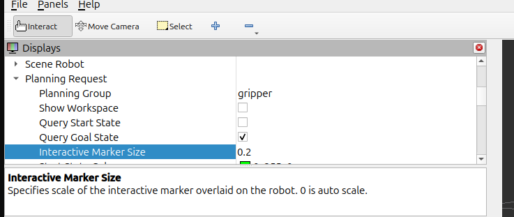

# AR4 Robot Arm

This is the ROS 2 project folder of the AR4 Robot Arm.

To install each packages' dependencies, execute the following commands in your ROS 2 workspace directory:

```
rosdep update
rosdep install --from-paths src -y --ignore-src
```

This project was tested using ROS 2 Jazzy and Ubuntu 24.04.
make sure you set it up and source ros2 .

Then build the packages while you are in your ROS 2 workspace directory:

> make sure you are the ar4_robot_arm directory i.e the ros2 workspace for this project

```
colcon build 
```

then

```
source install/setup.bash
```

To demo it in rviz,

```
ros2 launch ar4_robot_arm_moveit_setup demo.launch.py

```



>inside of rviz at the top left corner, set interactive marker size to 0.2  , now move your arm to a desired point. Hit plan and execute.


